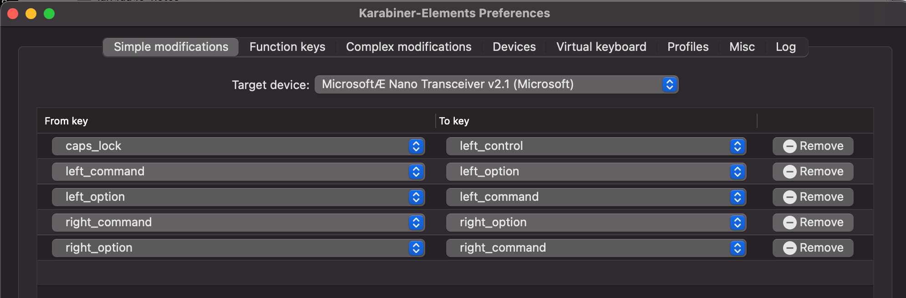

# Mac Setup

- [Set up Oh My Zsh](shell)
- [Set up Python](python)
- [Markdown and LaTeX with Pandoc](pandoc)

## Tools

- `fzf`? https://www.freecodecamp.org/news/fzf-a-command-line-fuzzy-finder-missing-demo-a7de312403ff/

### `ripgrep`

`brew install ripgrep`

- `rg 'comment' -t md -C5`
    + searches for text `comment` in `.md` files, including +/-5 lines of context
- `rg 'todo' -t md -l`
    - `-l` only returns files, instead of including the text match
    
## Optimizations

- Disable `mds` and `mdworker`
    + https://osxdaily.com/2010/08/05/mds-mac/
    + https://www.technipages.com/macos-sierra-enable-disable-spotlight
- Disable siri

## Using a Microsoft Keyboard

Set up [Karabiner](https://karabiner-elements.pqrs.org/).
Can set it up to **only** modify the keys on a specific device.

